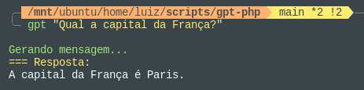

# OpenAI Console Chat

This repository contains two scripts that can be used independently to integrate the system terminal with the OpenAI API. The script allows you to ask questions and receive responses generated by the OpenAI language model, as well as automatically generate semantic commit messages based on the output of the git diff command.
Sure, here is the translated markdown:

## Examples

- Simple question:



- Generating semantic commits for git:


## Prerequisites

Before running the script, you need to have:

**For the PHP script:**
- PHP 7.4 or higher: `sudo apt install php`
- Curl extension: `sudo apt install php-curl`

**For the Python version:**
- Python: `sudo apt install python3`
- Requests library: `pip install requests`


## Getting Started
To run the script, you also need an OpenAI API key. If you don't have an API key yet, you can create one at [https://platform.openai.com/api-keys](https://platform.openai.com/api-keys).

The script checks if the OpenAI API key is set as an environment variable. If not, it will prompt you to enter the API key and add it to the shell configuration file for persistence.

The script is compatible with `bash` and `zsh` shells. It will automatically determine the correct configuration file based on the user's current shell.

### Installation
Run the install script:
```bash
./install.sh
```

Then, update the shell to recognize the new command or open a new terminal.

Now you can run the script globally in the terminal by typing `gpt` and passing the necessary arguments.
```bash
#Example:
gpt "what is the capital of Brazil?"
```

## Limitations

This script is a basic implementation to interact with the OpenAI API and may have some limitations. Be sure to review the OpenAI documentation for detailed information on how to use the API and any applicable limitations or restrictions.

## Contributions

If you encounter issues or have suggestions for improvement, feel free to open an issue or submit a pull request.

## License

This project is free to copy and distribute under the [MIT](LICENSE) license.